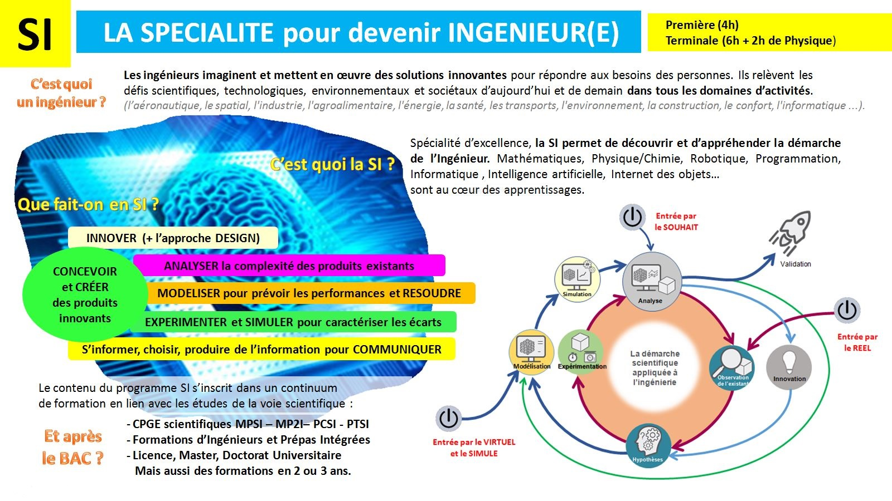
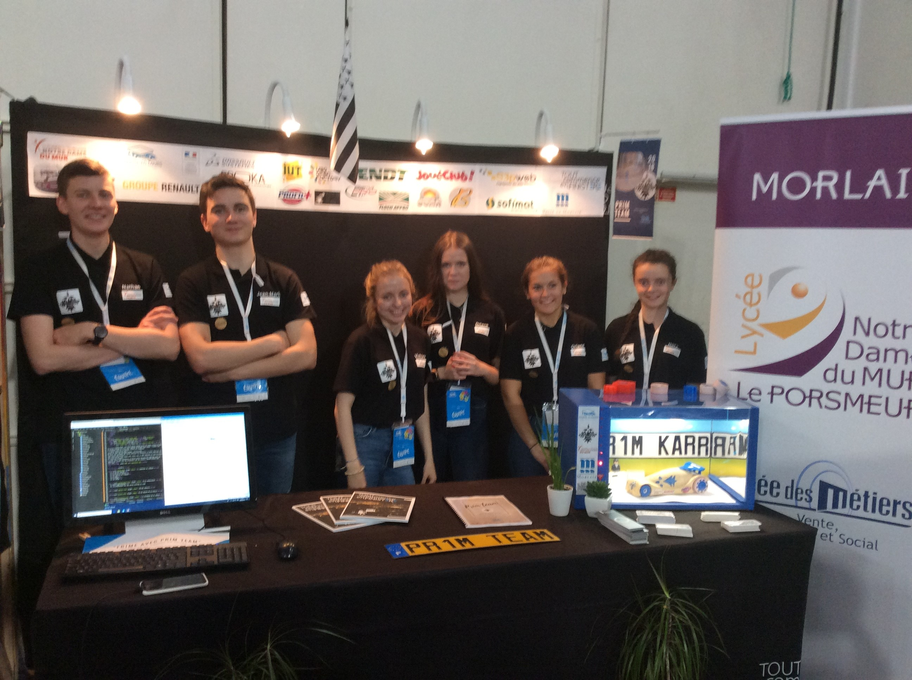
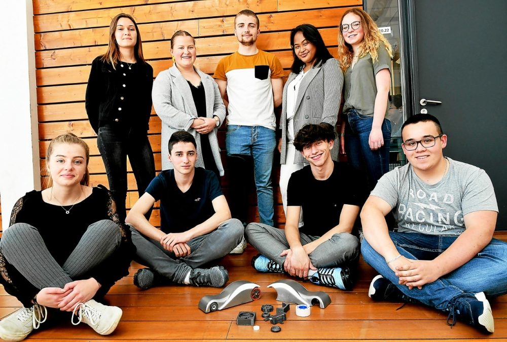

## Infographie :

<figure>

</figure>

## Témoignages :

<figure>
<iframe width="560" height="315" src="https://www.youtube-nocookie.com/embed/xLHrIXBbPLE" title="YouTube video player" frameborder="0" allow="accelerometer; autoplay; clipboard-write; encrypted-media; gyroscope; picture-in-picture" allowfullscreen></iframe>
<figcaption><a href="https://youtu.be/xLHrIXBbPLE">OSI - Pourquoi avoir choisi les Sciences de l'Ingénieur</a></figcaption>    
</figure>

<figure>
<iframe width="560" height="315" src="https://www.youtube-nocookie.com/embed/CJRVfcoOFKs" title="YouTube video player" frameborder="0" allow="accelerometer; autoplay; clipboard-write; encrypted-media; gyroscope; picture-in-picture" allowfullscreen></iframe>
<figcaption><a href="https://youtu.be/CJRVfcoOFKs">OSI - Conseillez-vous les Sciences de l'Ingénieur à un élève de seconde.</a></figcaption>    
</figure>

> "Choisir la spécialité SI au lycée, c’est apprendre les bases de l’ingénierie et de la technologie et développer sa capacité à innover." [Propos de Sébastien Gergadier, président de l'UPSTI, pour Studyrama](https://www.studyrama.com/formations/diplomes/bac/les-programmes-et-attendus-des-12-specialites/pour-choisir-la-specialite-si-il-faut-deja-avoir-une-106647)

## Description :

<figure>
<iframe width="560" height="315" src="https://www.youtube-nocookie.com/embed/y7yeb1OB1f4" title="YouTube video player" frameborder="0" allow="accelerometer; autoplay; clipboard-write; encrypted-media; gyroscope; picture-in-picture" allowfullscreen></iframe>
<figcaption><a href="https://youtu.be/y7yeb1OB1f4">Les Sciences de l'Ingénieur - www.upsti.fr</a></figcaption>    
</figure>

Sous l'appellation de sciences de l'ingénieur, sont rassemblées des disciplines scientifiques en rapport avec [l'ingénierie des systèmes](https://fr.wikipedia.org/wiki/Ing%C3%A9nierie_des_syst%C3%A8mes), notamment dans les domaines du génie mécanique, du génie civil, du génie électrique, de l'informatique et de l'automatique. Cette matière à forte culture industrielle forme des lycéens puis des étudiants à devenir ingénieur.

En France, les sciences de l'ingénieur forment des scientifiques dont l’activité est centrée sur la conception de produits répondant à certains besoins identifiés de la société. Elles développent donc des compétences techniques et permettent de travailler sur des projets concrets.

Les Sciences de l’Ingénieur s'adressent aux intellectuels qui ont également le sens des réalités. Il peut s’agir par exemple d’améliorer la performance énergétique des habitations, de travailler en bionique sur des prothèses, des drones, des robots humanoïdes, d’améliorer les solutions d’imagerie médicale ou les propriétés mécaniques d’un engin.

Les études de comportement des systèmes menées en classe de Sciences de l’Ingénieur (4h en première, 6h en terminale + 2h de Physique) utilisent beaucoup l'informatique pour analyser, modéliser, programmer, simuler et expérimenter...

Au lycée Notre Dame du Mur, la pédagogie appliquée en Sciences de l'Ingénieur s'appuie sur le développement de projets menés par équipe en fil rouge tout au long de l'année de première et de termminale comme par exemple la participation à des concours tels que [Course en Cours](https://www.course-en-cours.com/fr/) :

<figure>
<iframe width="560" height="315" src="https://www.youtube.com/embed/j44vyJqtnyM" title="YouTube video player" frameborder="0" allow="accelerometer; autoplay; clipboard-write; encrypted-media; gyroscope; picture-in-picture" allowfullscreen></iframe>
<figcaption><a href="https://youtu.be/j44vyJqtnyM">Course en Cours - Revivez la finale 2018 en images</a></figcaption>
    

<figcaption><a href="https://www.letelegramme.fr/finistere/morlaix/notre-dame-du-mur-en-concours-pour-course-en-cours-24-05-2018-11969648.php">Le Télégramme - Notre-Dame du Mur. En concours pour Course en Cours</a></figcaption>   

<figcaption><a href="https://www.letelegramme.fr/finistere/morlaix/course-en-cours-la-team-ikarr-2-0-en-finale-academique-23-05-2019-12291664.php">Le Télégramme - « Course en Cours ». La team Ikarr 2.0 en finale académique</a></figcaption>    
</figure>

## Liens complémentaires :

- [UPSTI : Que sont les Sciences de l'Ingénieur ?](https://www.upsti.fr/espace-etudiants/les-sciences-de-l-ingenieur)

- [ONISEP : LES SCIENCES DE L'INGÉNIEUR, C'EST QUOI ?](https://www.onisep.fr/Choisir-mes-etudes/Apres-le-bac/Les-sciences-de-l-ingenieur-c-est-quoi)

- [IH2EF : les sciences de l'ingénieur](https://youtu.be/8XMfFvb9qNI)

- [l'Etudiant : Ces formations qui demandent de suivre des spécialités précises...](https://www.letudiant.fr/etudes/parcoursup/parcoursup-ces-formations-qui-demandent-de-suivre-des-specialites-precises.html)

- [Programme de sciences de l’ingénieur de première et
terminale générales](https://cache.media.education.gouv.fr/file/SP1-MEN-22-1-2019/43/6/spe640_annexe_1063436.pdf)

- [https://sciencesindustrielles.com/](https://sciencesindustrielles.com/)